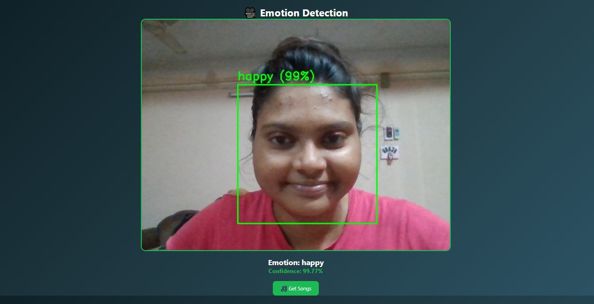
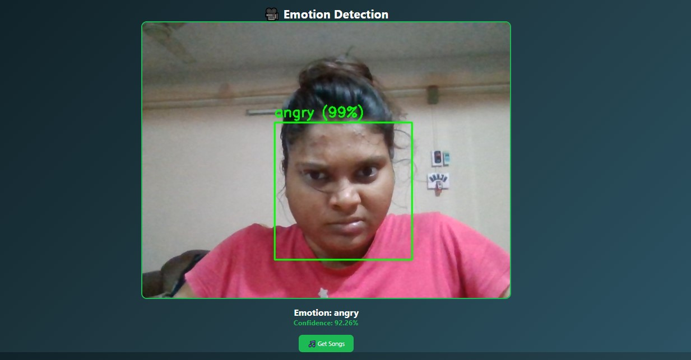

# 🎵 MoodTune – Emotion-Based Music Recommendation System

## 📌 Project Description
MoodTune is an AI-based web application that detects a user's facial emotion using a webcam and recommends songs accordingly. The system uses a deep learning model to classify emotions and maps them to suitable music.

---

## 🎯 Features
- Real-time face detection using OpenCV  
- Emotion classification using Deep Learning (ResNet model)  
- Music recommendation based on detected emotion  
- User-friendly web interface using Flask  

---

## 🧠 Technologies Used
- Python  
- Flask  
- OpenCV  
- TensorFlow / Keras  
- HTML, CSS  

---

## 💻 Software Requirements
- Python 3.10  
- VS Code / any IDE  
- Web Browser (Chrome recommended)  
- Git (optional)

---

## 🖥️ Hardware Requirements
- Webcam  
- Minimum 4GB RAM (8GB recommended)  
- Processor: Intel i3 or above  

---

## ⚙️ Installation & Setup

### 1. Clone the repository
```bash
git clone https://github.com/Tanisa-2003/MoodTune.git
cd MoodTune
```

### 2. Install dependencies
pip install -r requirements.txt

### 3. Download Model File
new_resnet_model.h5

### 4. Run the application
python app.py

---

## 🔄 Workflow
Input (Webcam/Image)
        ↓
Face Detection (OpenCV)
        ↓
Preprocessing
        ↓
Emotion Classification Model
        ↓
Emotion Output
        ↓
Music Recommendation
        ↓
Web Interface (Flask)

---

## 📊 Output Screenshots

<table>
  <tr>
    <td align="center">
      <b>😊 Emotion Detection</b><br>
      <br><br>
      
      <b>🎧 Music Recommendation</b><br>
      
    </td>

    <td align="center">
      <b>😊 Emotion Detection</b><br>
      <br><br>
      
      <b>🎧 Music Recommendation</b><br>
      
    </td>
  </tr>
</table>

## 📈 Model Performance
Accuracy: 94%
Dataset: Balanced RAF-DB

## 🧩 Future Improvements
Add voice-based emotion detection
Improve UI design
Use larger dataset for better accuracy
Mobile app integration

## 📌 Conclusion

This project demonstrates how Artificial Intelligence can be used to enhance user experience by understanding human emotions. The system successfully detects emotions and provides personalized music recommendations, making it both practical and innovative.

## 👩‍💻 Author

Tanisa Parui
MCA Student | Aspiring Developer